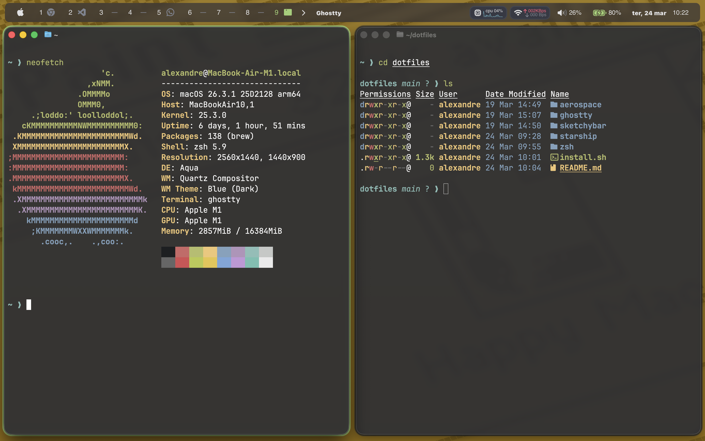

# My dotfiles

My personal dotfiles for macOS.

## Install

```shell
git clone https://github.com/lyralemos/dotfiles ~/dotfiles
cd ~/dotfiles
./install.sh
```

This will install:

* brew
* uv
* fzf
* zoxide
* Starship 
* eza 
* stow
* lua 
* switchaudio-osx 
* nowplaying-cli
* bun
* nvm
* Ghostty
* sketchybar
* AeroSpace
* Janky Borders

Dotfiles are managed by `stow`, so we clone this repo in `$HOME`.

SketchyBar is based in simplified version of [Felix Kratz's](https://github.com/FelixKratz/dotfiles) config with support for AeroSpace


